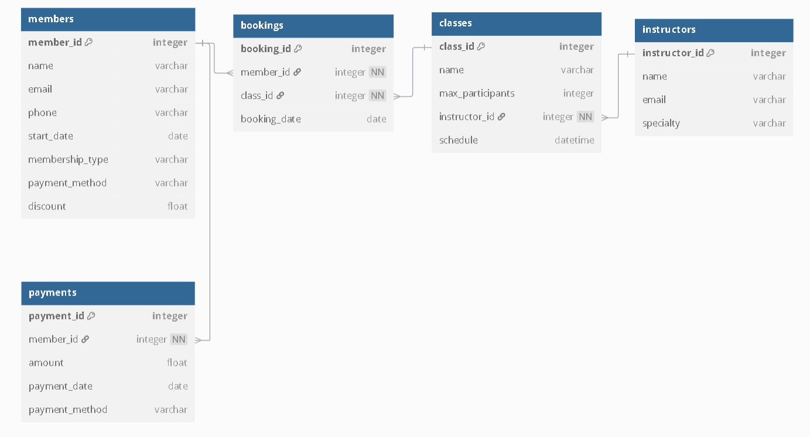
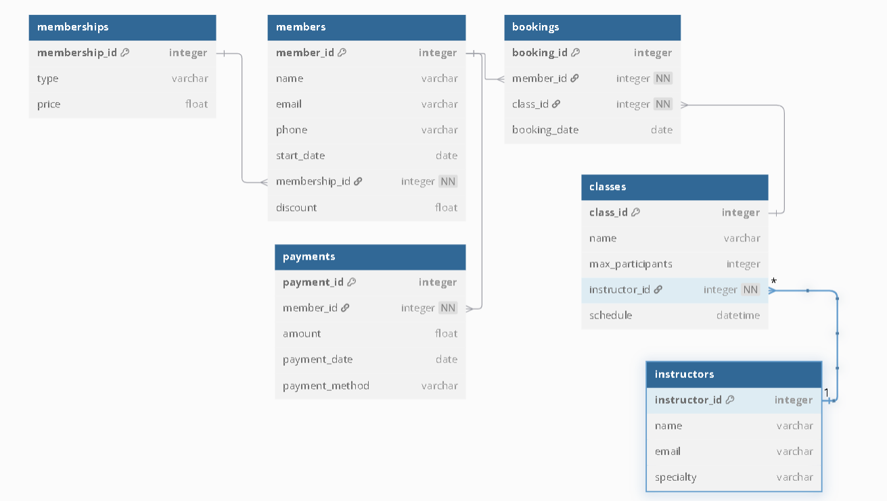

# Software Dev. OLA2-db 
# Timothy Busk Mortensen - cph-tm246@cphbusiness.dk 

# Relationer i Fitnesscenterets ER-model

## 1. Medlemmer og Træningshold (M:N-relation via Booking)
- Et medlem kan deltage i flere træningshold.
- Et træningshold kan have flere medlemmer.
- Dette håndteres via **Booking**, som skaber en mange-til-mange-relation.
- **Foreign Keys:**
  - `bookings.member_id → members.member_id`
  - `bookings.class_id → classes.class_id`

## 2. Instruktør og Træningshold (1:M-relation)
- En instruktør kan undervise på flere træningshold.
- Hvert træningshold har præcis én ansvarlig instruktør.
- **Foreign Key:**  
  - `classes.instructor_id → instructors.instructor_id`

## 3. Medlem og Betalinger (1:M-relation)
- Et medlem kan foretage flere betalinger over tid.
- Hver betaling er knyttet til ét bestemt medlem.
- **Foreign Key:**  
  - `payments.member_id → members.member_id`

## 4. Booking (Mange-til-mange-relation mellem Medlem og Træningshold)
- Booking-tabel forbinder medlemmer og træningshold.
- Et medlem kan have flere bookinger.
- Et træningshold kan have flere bookinger.
- **Foreign Keys:**  
  - `bookings.member_id → members.member_id`
  - `bookings.class_id → classes.class_id`

---

# Forretningsregler og Attributter

- **Medlemstype (`membership_type`)**  
  - Et medlem har én fast medlemskabstype (Basis, Premium, Elite).  
  - Dette lagres som en **attribut** i `members`-tabellen frem for en separat tabel, da medlemskabstypen ikke har yderligere egenskaber.

- **Rabat (`discount`)**  
  - Et medlem kan modtage en rabat i særlige tilfælde.  
  - Lagres som en **attribut** i `members`-tabellen, da der kun er én rabat per medlem.  
  - Hvis rabatter bliver mere komplekse (fx flere rabatter per medlem over tid), kan de flyttes til en separat `discounts`-tabel.

- **Maksimalt antal deltagere (`max_participants`)**  
  - Hvert træningshold har et fast maksimum af deltagere.  
  - Dette lagres som en **attribut** i `classes`-tabellen frem for en separat tabel, da det er en fast egenskab pr. hold.  
  - Hvis deltagergrænsen skulle variere per session, ville det kræve en `class_sessions`-tabel.

## ER Diagram

## Fordele og ulemper ved at oprette en `membership_type` tabel

### Fordele
1. **Bedre dataintegritet og mindre redundans**  
   - Hvis vi beholder `membership_type` som en simpel attribut i `members`, skal vi gentage information om medlemskab for hver medlem.  
   - Ved at oprette en `memberships`-tabel sikrer vi, at medlemskabstyper kun lagres ét sted, hvilket forhindrer inkonsistens.  

2. **Lettere at ændre medlemskabspriser**  
   - Hvis vi senere ændrer prisen for Premium, behøver vi kun at opdatere én række i `memberships` i stedet for alle medlemmer med Premium-medlemskab.  

3. **Gør systemet mere fleksibelt**  
   - Hvis vi vil tilføje flere medlemskabstyper i fremtiden, kan vi bare tilføje en ny række i `memberships`, uden at ændre database-strukturen.   

4. **Mulighed for at kontrollere adgang til klasser dynamisk**  
   - Med en `membership_classes` tabel kan vi styre præcist, hvilke klasser et medlemskab giver adgang til.  

---

### Ulemper
1. **Flere JOINs i forespørgsler**  
   - For at få information om et medlems medlemskab, skal vi lave en `JOIN` mellem `members` og `memberships`, hvilket kan påvirke ydeevnen ved mange forespørgsler.  

2. **Lidt mere kompleksitet i database-design**  
   - Vi skal oprette en ekstra tabel (`memberships`) og sikre, at alle medlemmer refererer til en gyldig `membership_id`.  
   - Kræver lidt mere administration af foreign-keys (FK).  

3. **Måske unødvendigt ved små databaser**  
   - Hvis fitnesscentret kun har 3 faste medlemskaber, og de sjældent ændres, kan det være overkill at oprette en ekstra tabel.  
   - Hvis der sjældent ændres i medlemskaber, kan en simpel ENUM-type i `members` være tilstrækkelig.  

---
### konklusion 
  - Modellen overholder de tre første normalformer i forvejen, men det er besluttet at oprette en memberships tabel. Selv om det introducerer en grad a kompleksitet, så er fordelene større end ulemperne. Jeg vil gerne være mere fleksibel i designet, da vi stadig kan nå at ændre mening på nuværende tidspunkt i processen. 
## NYT ER Diagram

# Database Normalisering: 1NF, 2NF og 3NF
---
## **Første Normalform (1NF)**

### **Definition**
En tabel er i Første Normalform (1NF) hvis:
1. Alle kolonner indeholder atomare værdier** (dvs. ingen kolonne må have flere værdier i én celle).
2. Hver kolonne indeholder værdier af samme datatype** (f.eks. må en kolonne ikke blande tal og tekst).
3. Hver række har en unik identifikation**, ofte ved hjælp af en primærnøgle.

**Eksempel på brud på 1NF:**  
| member_id | name  | phone_numbers     | membership_type |  
|-----------|-------|------------------|----------------|  
| 1         | Anna  | 12345678, 87654321 | Premium        |  
| 2         | Peter | 23456789          | Basis          |  

**Løsning:**  
Opdel `phone_numbers` i en ny tabel:  

**Opdateret tabel `members` (1NF):**  
| member_id | name  | membership_type |  
|-----------|-------|----------------|  
| 1         | Anna  | Premium        |  
| 2         | Peter | Basis          |  

**Ny tabel `member_phones`:**  
| phone_id | member_id | phone_number |  
|----------|-----------|-------------|  
| 1        | 1         | 12345678     |  
| 2        | 1         | 87654321     |  
| 3        | 2         | 23456789     |  

---
## **Anden Normalform (2NF)**

### **Definition**
En tabel er i **Anden Normalform (2NF)** hvis:
1. **Den er i 1NF**.
2. **Alle ikke-nøgleattributter er fuldstændigt funktionelt afhængige af hele primærnøglen**.  
   - Dvs. der må ikke være **partielle afhængigheder**, hvor en attribut kun afhænger af en del af en sammensat primærnøgle.

**Eksempel på brud på 2NF (før normalisering):**  
| booking_id | member_id | class_id | member_name | class_name |  
|------------|----------|---------|-------------|------------|  
| 1          | 101      | 5001    | Anna        | Yoga       |  
| 2          | 102      | 5002    | Peter       | Spinning   |  

**Problemet:**  
- `member_name` afhænger kun af `member_id`, ikke hele primærnøglen (`booking_id`).  
- `class_name` afhænger kun af `class_id`, ikke hele primærnøglen (`booking_id`).  

**Løsning:**  
- Opdel tabellen i separate tabeller for medlemmer og klasser.  

**Opdaterede tabeller (2NF):**  

**`bookings`:**  
| booking_id | member_id | class_id |  
|------------|----------|---------|  
| 1          | 101      | 5001    |  
| 2          | 102      | 5002    |  

**`members`:**  
| member_id | member_name |  
|----------|-------------|  
| 101      | Anna        |  
| 102      | Peter       |  

**`classes`:**  
| class_id | class_name  |  
|---------|------------|  
| 5001    | Yoga       |  
| 5002    | Spinning   |  

---

## **Tredje Normalform (3NF)**

### **Definition**
En tabel er i Tredje Normalform (3NF) hvis:
1. Den er i 2NF.
2. Den har ingen transitive afhængigheder, dvs. ingen ikke-nøgleattribut afhænger af en anden ikke-nøgleattribut.

### **Hvad er en transitiv afhængighed?**
En `transitiv afhængighed` opstår, når en ikke-nøgleattribut afhænger af en anden ikke-nøgleattribut, i stedet for at afhænge direkte af primærnøglen.

Hvis vi har følgende afhængigheder:

- **A → B** (A bestemmer B)
- **B → C** (B bestemmer C)

Så er der en transitiv afhængighed: **A → C**.

**Eksempel på brud på 3NF (før normalisering):**  
| member_id | name  | membership_type | membership_price |  
|-----------|------|----------------|-----------------|  
| 1         | Anna | Premium        | 299            |  
| 2         | Peter | Basis          | 199            |  

**Problemet:**  
- `membership_price` afhænger af `membership_type`, ikke direkte af `member_id`.  
- Hvis prisen ændres, skal vi opdatere **alle rækker** med den medlemskabstype.  

**Løsning:**  
- Flyt `membership_type` og `membership_price` til en separat `memberships`-tabel.  

**Opdaterede tabeller (3NF):**  

**`members`:**  
| member_id | name  | membership_id |  
|-----------|------|--------------|  
| 1         | Anna | 1            |  
| 2         | Peter | 2            |  

**`memberships`:**  
| membership_id | membership_type | membership_price |  
|--------------|----------------|-----------------|  
| 1            | Premium        | 299            |  
| 2            | Basis          | 199            |  

---
## **Opsummering af Normalformer**
| Normalform | Krav |
|------------|------|
| **1NF** | Ingen gentagende grupper eller multi-værdier i en enkelt celle. |
| **2NF** | Ingen partielle afhængigheder; hver ikke-nøgleattribut afhænger af hele primærnøglen. |
| **3NF** | Ingen transitive afhængigheder; ikke-nøgleattributter må ikke afhænge af andre ikke-nøgleattributter. |

## Every non-key attribute in a table should depend on the key, the whole key, and nothing but the key.

---

## Boyce-Codd Normal Form (BCNF)
- candidate key: an attribute, or combination of attributes, that uniquely identifies a row in the table. 
- prime attribute: an attribute that belongs to at least one candidate key.
- non-prime attribute: an attribute that doesn't belong to any candidate key.

## 2NF
- 2NF: We cannot have a non-prime attribute that depends on part of a candidate key. 
## 3NF
- 3NF: each non-prime attribute in a table should depend on every candidate key: it should never depend on part of a candidate key; and it should never depend on other non-prime attributes.
## BCNF
- With the exception of trivial functional dependencies, every function dependency in a table must be a dependency on a candidate key (or on a superset of a candidate key).
- With the exception of trivial functional dependencies, every function dependency in a table must be a dependency on a `superkey`
---

# Relationsmodel

## MEMBER  
**Attributter:**  
- `member_id` (PK)  
- `name` (VARCHAR(100))  
- `email` (VARCHAR(100))  
- `phone` (VARCHAR(20))  
- `start_date` (DATE)  
- `membership_id` (FK til MEMBERSHIP)  
- `discount` (DECIMAL, fx DECIMAL(5,2))  

**Eksempel:**  
`MEMBER (member_id PK, name VARCHAR(100), email VARCHAR(100), phone VARCHAR(20), start_date DATE, membership_id FK, discount DECIMAL(5,2))`  

## MEMBERSHIP  
**Attributter:**  
- `membership_id` (PK)  
- `type` (ENUM('Basis', 'Premium', 'Elite'))  
- `price` (DECIMAL, fx DECIMAL(10,2))  

**Eksempel:**  
`MEMBERSHIP (membership_id PK, type ENUM('Basis', 'Premium', 'Elite'), price DECIMAL(10,2))`  

## INSTRUCTOR  
**Attributter:**  
- `instructor_id` (PK)  
- `name` (VARCHAR(100))  
- `email` (VARCHAR(100))  
- `specialty` (VARCHAR(100))  

**Eksempel:**  
`INSTRUCTOR (instructor_id PK, name VARCHAR(100), email VARCHAR(100), specialty VARCHAR(100))`  

## CLASS  
**Attributter:**  
- `class_id` (PK)  
- `name` (VARCHAR(100))  
- `max_participants` (INT)  
- `instructor_id` (FK til INSTRUCTOR)  
- `schedule` (DATETIME)  

**Eksempel:**  
`CLASS (class_id PK, name VARCHAR(100), max_participants INT, instructor_id FK, schedule DATETIME)`  

## BOOKING  
**Attributter:**  
- `booking_id` (PK)  
- `member_id` (FK til MEMBER)  
- `class_id` (FK til CLASS)  
- `booking_date` (DATE)  

**Eksempel:**  
`BOOKING (booking_id PK, member_id FK, class_id FK, booking_date DATE)`  

## PAYMENT  
**Attributter:**  
- `payment_id` (PK)  
- `member_id` (FK til MEMBER)  
- `amount` (DECIMAL, fx DECIMAL(10,2))  
- `payment_date` (DATE)  
- `payment_method` (VARCHAR(50))  

**Eksempel:**  
`PAYMENT (payment_id PK, member_id FK, amount DECIMAL(10,2), payment_date DATE, payment_method VARCHAR(50))`  

